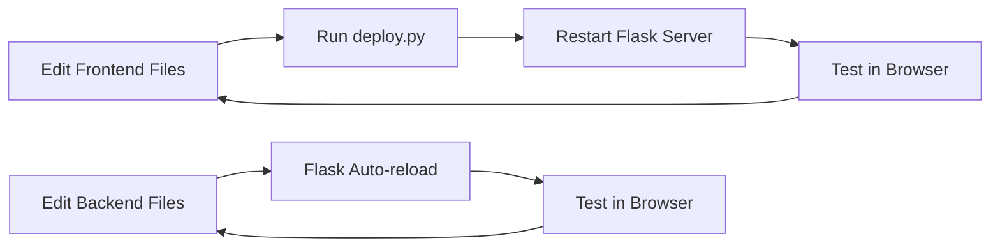

# Development Environment Setup Guide

## Project Overview

Stock Market Scanner & Alert System - A Flask-based web application for monitoring stock market data and alerts.

## Project Structure

```
stockMarketScanner&AlertSystem/
├── backend/                 # Backend Flask application
│   ├── app.py              # Main Flask application
│   ├── database.py         # Database operations
│   ├── requirements.txt    # Python dependencies
│   ├── stock_app.db        # SQLite database
│   ├── templates/          # HTML templates (auto-generated)
│   └── static/             # Static assets (auto-generated)
├── frontend/               # Frontend source code
│   ├── templates/          # HTML template files
│   └── static/             # CSS, JS, images
├── deploy.py               # Frontend deployment script
├── run.py                  # Quick start script
└── .gitignore             # Git ignore rules
```

## Prerequisites

- **Python**: 3.8 or higher
- **pip**: Python package manager
- **Git**: Version control (optional)

## Initial Setup

### 1. Clone the Repository (if applicable)

```bash
git clone <repository-url>
cd stockMarketScanner&AlertSystem
```

### 2. Create Virtual Environment

```bash
# Create virtual environment
python3 -m venv venv

# Activate virtual environment
# On macOS/Linux:
source venv/bin/activate

# On Windows:
venv\Scripts\activate
```

### 3. Install Dependencies

If you need to use proxy for faster downloads:

```bash
# Enable proxy (macOS/Linux)
po

# Install Python packages
pip install -r backend/requirements.txt
```

**Required packages:**
- Flask==3.0.0
- flask-cors==4.0.0
- werkzeug==3.0.1

## Development Workflow

### Quick Start (Recommended)

The easiest way to start the application:

```bash
python run.py
```

This script will:
1. Deploy frontend files to backend directories
2. Start the Flask development server

### Manual Start

If you prefer more control:

#### Step 1: Deploy Frontend

```bash
# One-time deployment
python deploy.py

# Watch mode (auto-redeploy on file changes)
python deploy.py --watch
```

#### Step 2: Start Flask Server

```bash
cd backend
python app.py
```

The application will be available at: `http://localhost:5000`

## Development Scripts

### deploy.py

Copies frontend files to backend directories for Flask to serve.

**Usage:**
```bash
# Single deployment
python deploy.py

# Watch mode (monitors file changes)
python deploy.py --watch
```

**What it does:**
- Cleans `backend/templates/` and `backend/static/`
- Copies all HTML files from `frontend/templates/` to `backend/templates/`
- Copies all static assets from `frontend/static/` to `backend/static/`

### run.py

Quick start script that combines deployment and server startup.

**Usage:**
```bash
python run.py
```

## Working with Frontend

### Directory Structure

```
frontend/
├── templates/
│   └── *.html          # HTML template files
└── static/
    ├── css/            # Stylesheets
    ├── js/             # JavaScript files
    └── images/         # Image assets
```

### Making Changes

1. Edit files in `frontend/templates/` or `frontend/static/`
2. Run deployment script:
   ```bash
   python deploy.py
   ```
3. Refresh browser to see changes

**Tip:** Use watch mode during active development:
```bash
python deploy.py --watch
```

## Working with Backend

### Main Files

- **app.py**: Flask application routes and logic
- **database.py**: Database operations and models
- **stock_app.db**: SQLite database file

### Making Changes

1. Edit Python files in `backend/`
2. Restart Flask server (Ctrl+C then restart)
3. Flask debug mode will auto-reload on code changes

### Database Operations

The application uses SQLite. Database file: `backend/stock_app.db`

To inspect the database:
```bash
sqlite3 backend/stock_app.db
```

## Common Tasks

### Add New Dependencies

```bash
# Install new package
pip install <package-name>

# Update requirements.txt
pip freeze > backend/requirements.txt
```

### Reset Frontend Deployment

```bash
# Clean and redeploy
python deploy.py
```

### View Application Logs

Flask will output logs to the console where you started the server.

### Stop the Application

Press `Ctrl+C` in the terminal running the Flask server.

## Troubleshooting

### Port Already in Use

If port 5000 is already in use:
1. Find and stop the process using port 5000
2. Or modify `backend/app.py` to use a different port

### Frontend Changes Not Showing

1. Ensure you ran `python deploy.py` after making changes
2. Hard refresh browser (Ctrl+Shift+R or Cmd+Shift+R)
3. Clear browser cache

### Import Errors

```bash
# Ensure virtual environment is activated
source venv/bin/activate  # macOS/Linux
venv\Scripts\activate     # Windows

# Reinstall dependencies
pip install -r backend/requirements.txt
```

### Database Locked

If you get "database is locked" error:
1. Close all connections to the database
2. Restart the Flask server

## Best Practices

### Version Control

The following are automatically ignored (see `.gitignore`):
- `backend/templates/` (auto-generated)
- `backend/static/` (auto-generated)
- `__pycache__/`
- `venv/`
- `*.db-journal`

### Development Workflow



### Code Style

- Follow PEP 8 for Python code
- Use meaningful variable and function names
- Add comments for complex logic
- Keep functions small and focused

## Production Deployment

For production deployment:

1. Set Flask environment to production:
   ```bash
   export FLASK_ENV=production
   ```

2. Use a production WSGI server (e.g., Gunicorn):
   ```bash
   pip install gunicorn
   gunicorn -w 4 -b 0.0.0.0:5000 app:app
   ```

3. Consider using a reverse proxy (nginx, Apache)

4. Set up proper logging and monitoring

## Additional Resources

- [Flask Documentation](https://flask.palletsprojects.com/)
- [Python Virtual Environments](https://docs.python.org/3/tutorial/venv.html)
- [SQLite Documentation](https://www.sqlite.org/docs.html)

## Support

For issues or questions:
1. Check this documentation
2. Review error messages in console
3. Check Flask and Python documentation
4. Contact the development team

---

**Last Updated**: 2025-11-20
